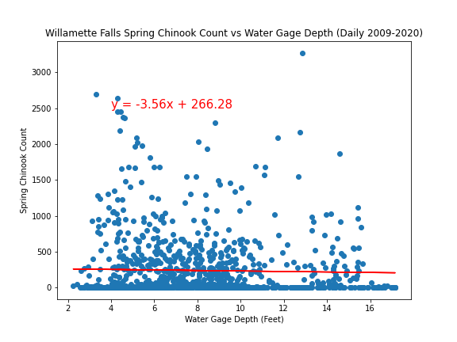

# Spring Chinook Salmon in the Portland Metro Area

## Project Description

**Goal:** Our goal was to find a correlation between the “2008-2019” water’s effect on the Native Chinook Salmon Populations in the “Lower Columbia” area during their migration cycle to spawn in the “Spring”.

**Background:** Chinook Salmon is on the "endangered species" list that the "state" is actively tracking to protect.
As a keystone species it is of utmost importance to implement measures for conservation and education.

**Proposal:** Target whether past state conservation efforts have been effective.

## Files

- [Final Analysis](Final_Analysis.ipynb) - Jupyter Notebook for that contains the final analysis results, this notebook uses the final cleaned data from all other notebooks used to scrub and load data

- [<Spring Chinook Salmon in the Portland Metro Area>](<Spring Chinook Salmon in the Portland Metro Area.pptx>) - Presentation for the Spring Chinook Analysis

## Results

- Annual Spring Chinook Run Bonneville Dam

  

- Daily Spring Chinook vs Below Bonneville Water Depth

  

  

- Daily Spring Chinook vs Below Bonneville Water Temperature

  

  

-Annual Spring Chinook Run Willamette Falls

- Daily Spring Chinook vs Willamette Water Depth

  

  

- Daily Spring Chinook vs Willamette Water Temperature

  

  
