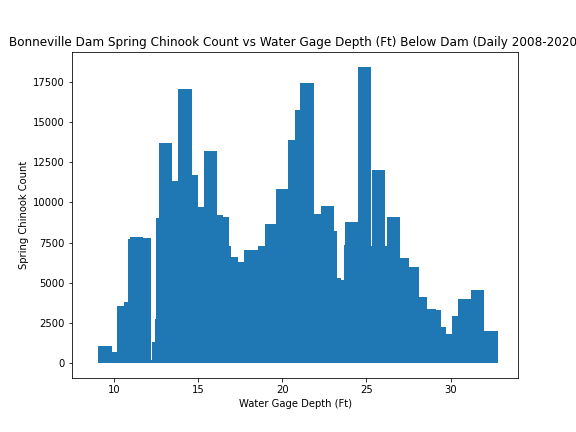
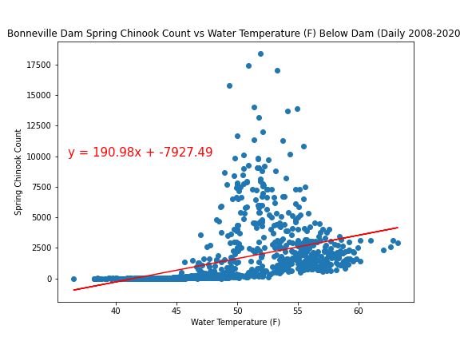
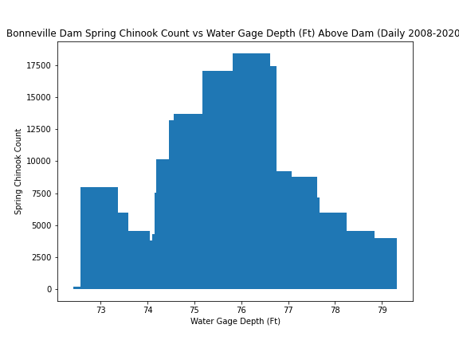
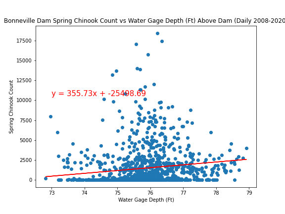
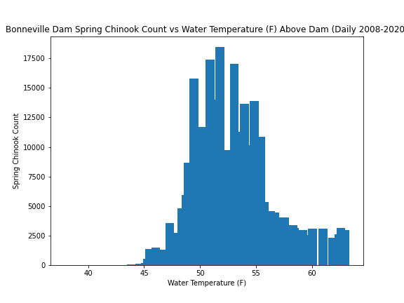
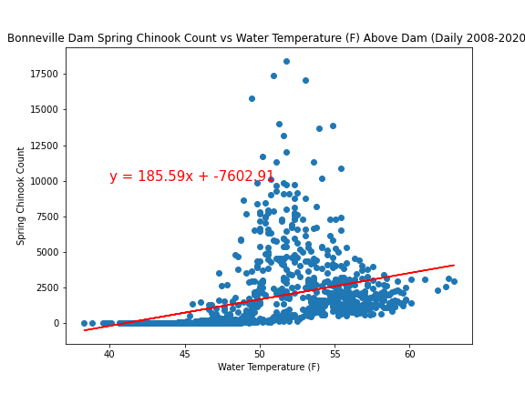
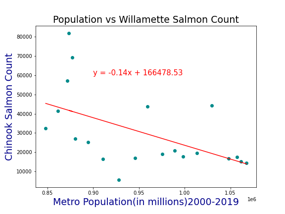

# Spring Chinook Salmon in the Portland Metro Area

## Project Description

**Goal:** Our goal was to find a correlation between the “2008-2019” water’s effect on the Native Chinook Salmon Populations in the “Lower Columbia” area during their migration cycle to spawn in the “Spring”.

**Background:** Chinook Salmon is on the "endangered species" list that the "state" is actively tracking to protect.
As a keystone species it is of utmost importance to implement measures for conservation and education.

**Proposal:** Target whether past state conservation efforts have been effective.

## Files

- [`Final_Analysis.ipynb`](Final_Analysis.ipynb) - Jupyter Notebook for that contains the final analysis results, this notebook uses the final cleaned data from all other notebooks used to scrub and load data

- [Spring Chinook Salmon in the Portland Metro Area](Spring%20Chinook%20Salmon%20in%20the%20Portland%20Metro%20Area.pptx) - Presentation for the Spring Chinook Analysis

- [Resources](Resources/) - The body of data the team filtered through for the end analysis

- [Research](Research/) - Research and experimentation jupyter notebooks used to arrive at final data sets

## Results

- Annual Spring Chinook Run Bonneville Dam

  

- Daily Spring Chinook vs Below Bonneville Water Depth

  

  

- Daily Spring Chinook vs Below Bonneville Water Temperature

  

  

- Daily Spring Chinook vs Above Bonneville Water Depth

  

  

- Daily Spring Chinook vs Above Bonneville Water Temperature

  

  

-Annual Spring Chinook Run Willamette Falls

- Daily Spring Chinook vs Willamette Water Depth

  

  

- Daily Spring Chinook vs Willamette Water Temperature

  

  

- Annual Portland Metro Population vs Spring Chinook

  

  

  

  

## Authors

Made by Jenny Kaylor, Josh Williams, Jay Hastings, Erica Fisher and Courtney Muhlbach
with :heart: in 2020.
